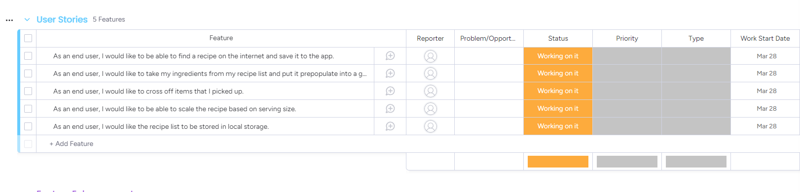

# Grocery Grabber

Grocery Grabber is a web application built using HTML, CSS, and JavaScript. It allows users to create and manage their grocery list using browser local storage. The application also includes a recipe page where users can quickly add predefined ingredients to their grocery list.

## Usage

To use the Grocery Grabber application, simply go to [the link for deployed website](https://re-factored.github.io/grocery-grabber/) in your web browser. The application does not require any additional installations or dependencies.

## Features

Grocery Grabber offers the following features:

- **Grocery list management:** Users can create and manage their grocery list using browser local storage. They can add and remove items from their list, as well as mark items as completed.

- **Recipe page:** The application includes a recipe page where users can quickly add predefined ingredients to their grocery list. They can choose from a list of popular recipes, or create their own custom recipe.

- **Responsive design:** The application is designed to work on desktop and mobile devices, with a responsive layout that adapts to different screen sizes.

## Technologies Used

Grocery Grabber was built using the following technologies:

- HTML
- CSS
- JavaScript

## License

Grocery Grabber is released under the MIT license. See [LICENSE](./LICENSE) for more information.

## Team Members

- [Joshua Coffey](https://github.com/Coff23)
- [Tom Sharkey](https://github.com/tbsharkey)
- [Michael Grant](https://github.com/MRGrant82)
- [Donna Ada](https://github.com/donnaada)

## Wireframe

We used Figma to create the wireframe for the Grocery Grabber application. The wireframe is shown below:

## Domain Model

We used InVision App to create the domain model for the Grocery Grabber application. The domain model is shown below:

## User Stories Project Management Board

We used Monday.com to manage the project for the Grocery Grabber application. The project management board is shown below:

